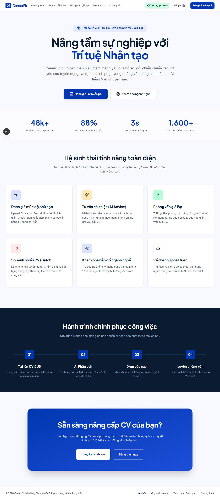
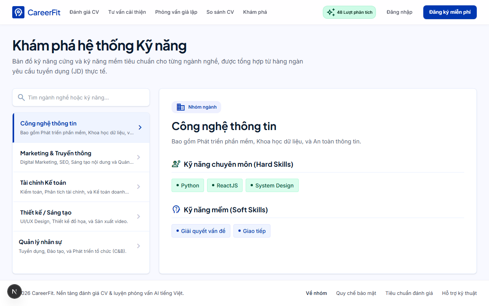
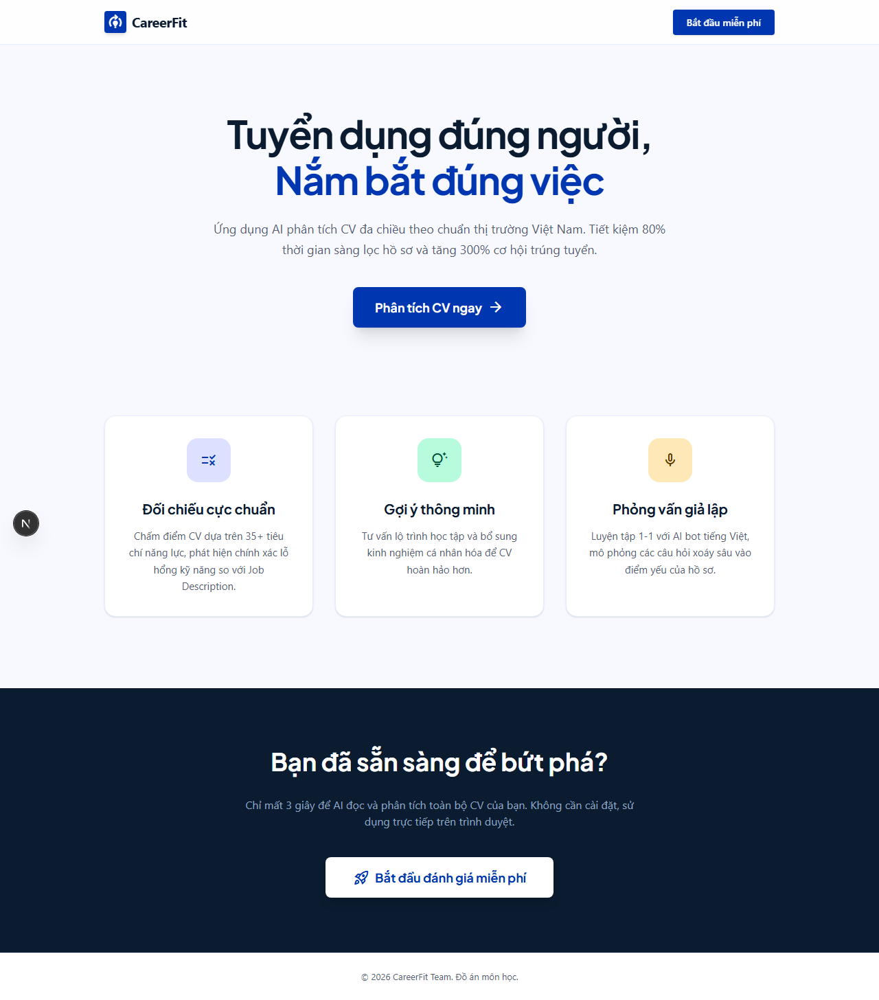
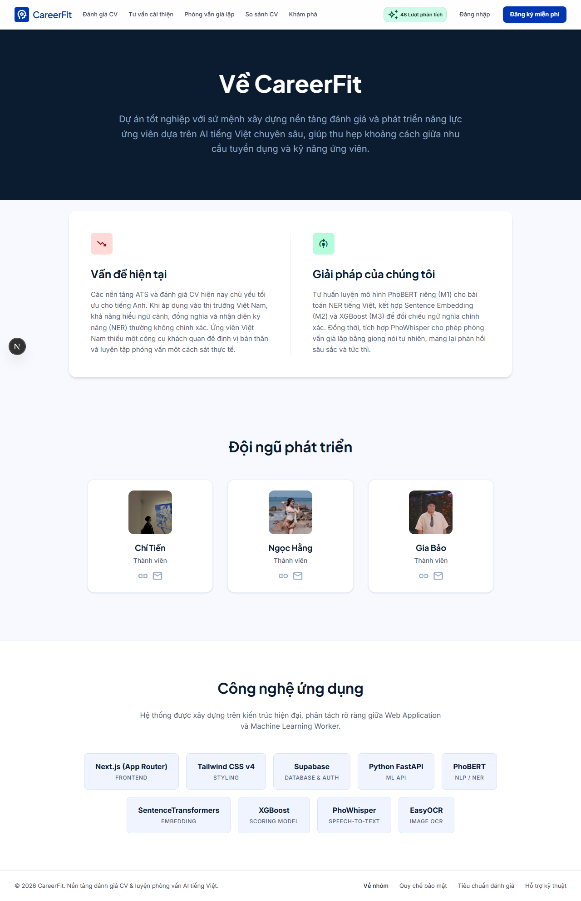

# CareerFit 🎯

**Hệ sinh thái đánh giá năng lực & Luyện phỏng vấn AI Tiếng Việt**



> **CareerFit** là nền tảng ứng dụng AI chuyên sâu giúp người tìm việc định vị bản thân và cải thiện kỹ năng so với yêu cầu thị trường (JD). Dự án tự hào được phát triển từ đầu các mô hình AI tiếng Việt (NER, Embedding, Scoring) nhằm mang lại độ chính xác cao nhất cho dữ liệu tuyển dụng đặc thù tại Việt Nam.

---

## 🌟 Tính năng nổi bật

### 1. Đánh giá CV & Phân tích độ phù hợp (CV Scoring)
So sánh CV của bạn với mô tả công việc (JD) để đưa ra điểm số tương thích. Trích xuất chi tiết các kỹ năng cứng và mềm (Hard/Soft skills) thông qua mô hình PhoBERT-NER và XGBoost.
Hỗ trợ đọc PDF, JPG, PNG nhờ tích hợp EasyOCR.

### 2. Tư vấn cải thiện cá nhân hóa (AI Advise)
Hệ thống nhận diện các "lỗ hổng" kỹ năng (Skill Gaps) giữa CV và JD, từ đó gợi ý lộ trình học tập, chứng chỉ cần thiết và cách bổ sung kinh nghiệm một cách sát thực tế.

### 3. Khám phá Bản đồ Ngành nghề
Tra cứu hệ thống kỹ năng chuẩn cho 17 nhóm ngành lớn tại thị trường Việt Nam.


### 4. Luyện phỏng vấn giả lập (Voice AI Interview)
Trải nghiệm phỏng vấn 1-1 bằng giọng nói với AI. Câu hỏi được cá nhân hoá dựa trên chính điểm yếu trong CV của bạn. Sử dụng công nghệ PhoWhisper để nhận diện giọng nói tiếng Việt chuẩn xác.

### 5. So sánh hàng loạt CV (Dành cho nhà tuyển dụng)
Đánh giá và xếp hạng đồng thời nhiều hồ sơ cho cùng một vị trí, tiết kiệm 80% thời gian sàng lọc (Screening).

---

## 🎨 Giao diện thân thiện, chuẩn hóa


*Giao diện Landing Page tập trung vào trải nghiệm người dùng, thiết kế hiện đại với Tailwind CSS.*

---

## ⚙️ Kiến trúc & Công nghệ (Tech Stack)

| Lớp (Layer) | Công nghệ sử dụng |
|---|---|
| **Frontend** | Next.js 16 (App Router), TypeScript, Tailwind CSS v4 |
| **Backend & ML** | Python, FastAPI, Worker polling, DVC |
| **AI Models** | PhoBERT (NLP/NER), SentenceTransformers (Embedding), XGBoost (Scoring), PhoWhisper (Speech-to-Text), EasyOCR (Image text extraction) |
| **Database & Auth** | Supabase (PostgreSQL, Auth, Storage) |

---

## 📋 Yêu cầu cài đặt

| Công cụ | Phiên bản | Link tải |
|---|---|---|
| Node.js | 20+ | https://nodejs.org |
| Git | Mới nhất | https://git-scm.com |
| VS Code | Mới nhất | https://code.visualstudio.com |
| Python | 3.10+ | https://python.org (cho ML service) |

---

## 🚀 Setup lần đầu (Cành cho thành viên nhóm)

### Bước 1 — Clone repo

```bash
git clone https://github.com/herSummer39/cv_hang_bao_tien.git
cd cv_hang_bao_tien
```

### Bước 2 — Tạo file môi trường

Tạo file `apps/web/.env.local` (xin 2 keys từ trưởng nhóm qua Zalo):

```bash
# Windows — PowerShell
New-Item -Path "apps\web\.env.local" -ItemType File
```

Nội dung file `.env.local`:

```
NEXT_PUBLIC_SUPABASE_URL=<xin từ trưởng nhóm>
NEXT_PUBLIC_SUPABASE_ANON_KEY=<xin từ trưởng nhóm>
```
> ⚠️ File này đã có trong `.gitignore` — **KHÔNG được commit lên GitHub!**

### Bước 3 — Cài dependencies web app

```bash
cd apps/web
npm install
```

### Bước 4 — Cài dependencies ML service (nếu làm phần AI)

```bash
cd packages/ml-service
pip install -r requirements.txt
```

### Bước 5 — Chạy app

```bash
# Từ thư mục apps/web
npm run dev
```

Mở trình duyệt: **http://localhost:3000** ✅

---

## 📅 Hướng dẫn Git hằng ngày

### 1. Kéo code mới nhất (Mỗi sáng)
```bash
git pull origin master
```

### 2. Viết code & Push (Commit quy chuẩn)
```bash
git add .
git commit -m "feat: add score result page"
git push origin master
```

**Quy tắc đặt tên commit:**
- `feat:` thêm tính năng mới
- `fix:` sửa bug
- `ui:` thay đổi giao diện
- `db:` thay đổi database
- `ml:` thay đổi AI/model
- `docs:` cập nhật tài liệu

---

## 🤖 Quản lý AI/ML Pipeline (`packages/ml-service`)

**Sinh data training:**
```bash
python scripts/generate_training_data.py
```
**Train Embedding model:**
```bash
python scripts/train_m2_embedding.py --mode full
```
**Test OCR/Parser:**
```bash
python scripts/test_ocr_extraction.py
```

---

## 👥 Đội ngũ phát triển



Dự án đồ án tốt nghiệp phát triển bởi:
- **Trần Thị Ngọc Hằng** - Trưởng nhóm
- **Lê Gia Bảo** - Thành viên
- **Hạ Chí Tiền** - Thành viên

🔗 **GitHub Repo:** https://github.com/herSummer39/cv_hang_bao_tien
